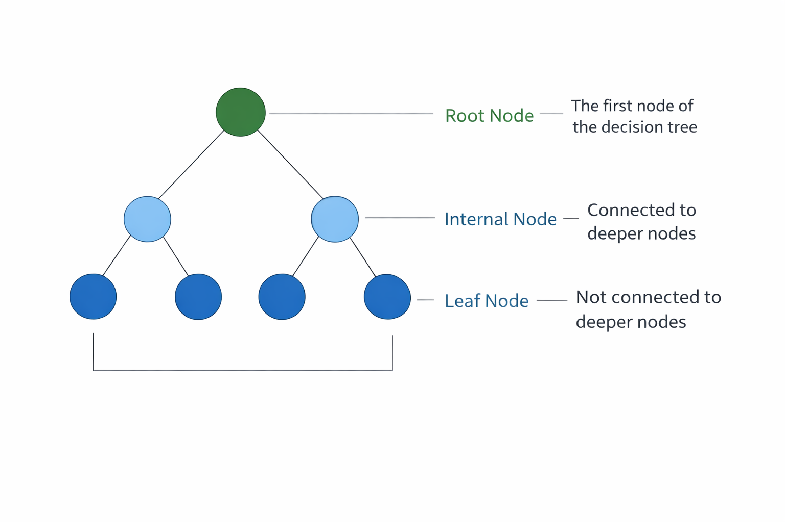

### 1. Introduction to Decision Tree

A Decision Tree is one of the most popular supervised machine learning algorithms used for both classification and regression problems. It is called a decision tree because its structure resembles a tree where decisions are made step by step.

In a decision tree, the dataset is divided into smaller groups based on certain conditions on the features. These conditions are arranged in a tree-like structure where each path from the root node to a leaf node represents a sequence of decisions that leads to a final prediction.

Because of its simple structure and easy interpretation, the decision tree algorithm is widely used in many applications such as medical diagnosis, customer purchase prediction, loan approval systems, and fraud detection.

### 2. Structure of a Decision Tree

A decision tree consists of several components that together form the structure of the model as shown the Figure 1.

#### 2.1 Root Node

The root node is the topmost node of the decision tree. It represents the entire dataset and is the starting point of the decision-making process. The algorithm selects the most important feature at this node to split the dataset.

#### 2.2 Internal Nodes

Internal nodes are also called decision nodes. These nodes represent conditions or tests applied to the dataset. Based on the result of the test, the data moves to the next branch.

#### 2.3 Branches

Branches represent the possible outcomes of a test performed at a node. Each branch connects one node to another and shows the direction that the data follows depending on the attribute value.

#### 2.4 Leaf Nodes

Leaf nodes are also called terminal nodes. These nodes represent the final decision or prediction made by the model. In classification problems, they represent class labels, while in regression problems they represent numerical values.

Figure 1: Basic structure of a decision tree

### 3. Decision Tree Learning Concept

The learning process of a decision tree revolves around one central principle: recursively partitioning the training data into progressively purer subsets with respect to the target variable. The goal is to create regions in the feature space where most or all samples belong to the same class (for classification) or have similar output values (for regression).

At the start of training, the entire dataset is placed at the root node. The algorithm then searches through all available features and all possible split points for each feature to find the split that best separates the data. Once a split is chosen, the data is divided into subsets, and the same process is applied recursively to each subset. This continues until a stopping condition is met.

The concept of homogeneity is central to this process. A node is considered pure if all the samples it contains belong to the same class. As the tree grows deeper, each node should ideally contain a more homogeneous set of samples than its parent.

This recursive partitioning is what allows decision trees to model complex, non-linear relationships between features and the target variable without requiring explicit feature engineering. The recursive nature of this process means that the tree grows by repeatedly applying the same splitting logic to smaller and smaller subsets of the data. At each level of the tree, the algorithm makes the locally optimal choice of feature and split point, which is known as a greedy approach. While this greedy strategy is computationally efficient, it does not guarantee a globally optimal tree structure.

### 4. Splitting Criteria

To decide which feature should be used to split the dataset at each node, the decision tree algorithm uses certain mathematical measures known as splitting criteria. Two commonly used criteria are Entropy (Information Gain) and Gini Index.

#### 4.1 Entropy

Entropy measures the uncertainty or impurity in a dataset. If all the data points belong to the same class, the entropy value becomes zero, which means the data is perfectly pure. If the data contains a mixture of different classes, the entropy value becomes higher.

Entropy is calculated using the following formula:

    
        Entropy(<i>S</i>) = &minus;
        

            
<i>c</i>

            
&sum;

            
<i>i</i>=1

        

        <i>pi</i> log2(<i>pi</i>)
    

where p_i represents the probability of each class in the dataset.

Using entropy, the algorithm calculates Information Gain, which measures how much uncertainty is reduced after splitting the dataset using a particular attribute. The attribute with the highest information gain is selected for splitting.

#### 4.2 Gini Index

The Gini Index is another measure used to evaluate the quality of a split. It represents the probability of incorrectly classifying a randomly chosen element from the dataset.

The formula for Gini Index is:

    
        Gini = 1 &minus;
        

            
<i>c</i>

            
&sum;

            
<i>i</i>=1

        

        <i>pi</i>2
    

A lower Gini value indicates that the node is purer and contains mostly samples from a single class.

### 5. Tree Construction Process

The construction of a decision tree follows a systematic, top-down procedure. Beginning with the entire dataset at the root, the tree is built by repeatedly applying splitting rules to create child nodes, expanding level by level until one or more stopping conditions are satisfied. The general process unfolds as follows:

1. The entire training dataset is placed at the root node.
2. The algorithm evaluates every feature and every possible split threshold for that feature.
3. For each candidate split, the splitting criterion (Entropy or Gini Index) is computed.
4. The feature and split point that produce the best criterion value are selected.
5. The dataset is divided into subsets based on the chosen split, and child nodes are created.
6. Steps 2 through 5 are applied recursively to each child node using only the samples that reached that node.
7. The process continues until a stopping condition is met, at which point the node becomes a leaf.

A decision tree stops growing when certain stopping conditions are satisfied. The growth of the tree terminates if all samples within a node belong to the same class, if the number of samples in the node becomes too small to allow further meaningful splitting, or if a predefined maximum depth of the tree is reached. The splitting process may also stop when further partitioning does not improve the chosen decision criterion, in which case the node is designated as a leaf node and assigned a class label. It is important to note that the decision tree construction algorithm follows a greedy approach, meaning that at each node it selects the best possible split based only on the current data without reconsidering previous decisions. As a result, the final tree structure may not always represent the globally optimal solution, which is why techniques such as pruning and ensemble methods are often employed to improve model performance.

### 6. Pruning Techniques

One of the most significant challenges with decision trees is overfitting. When a tree is allowed to grow without restrictions, it tends to learn the training data too precisely, including noise and outliers, resulting in a highly complex model that performs poorly on new, unseen data. Pruning is the process of simplifying a decision tree to reduce overfitting and improve its generalization capability.

#### Pre-Pruning (Early Stopping)

Pre-pruning, also known as early stopping, prevents the tree from growing beyond a certain point during the construction phase itself. Instead of building the full tree and then simplifying it, the algorithm stops creating new branches when certain conditions are met. Common pre-pruning strategies include:

- Setting a maximum depth limit on the tree, preventing it from growing too deep.
- Requiring a minimum number of samples before a node can be split further.
- Requiring that any split must improve the splitting criterion by at least a minimum amount.

Pre-pruning is computationally efficient because it avoids building parts of the tree that will later be removed. However, it risks stopping too early and producing an underfitted model that misses important patterns in the data.

#### Post-Pruning

Post-pruning is applied after the tree has been fully grown. The algorithm first builds the complete tree and then works backwards, evaluating whether removing certain subtrees or replacing them with leaf nodes improves the model's performance on a validation dataset. The most commonly used post-pruning method is Cost-Complexity Pruning (also called Reduced-Error Pruning or Weakest Link Pruning).

In Cost-Complexity Pruning, a complexity parameter (often called &alpha;) is introduced to penalize large tree sizes. By tuning this parameter, one can control the trade-off between tree size and accuracy. Larger values of &alpha; produce smaller, simpler trees, while smaller values allow more complex trees. Cross-validation is typically used to select the optimal value of &alpha;.

Post-pruning generally produces better results than pre-pruning because it makes decisions based on the full picture of the tree, but it is more computationally demanding.

### 7. Decision Tree Algorithm

Step 1: Start with entire dataset at root node

Step 2: If all samples belong to same class, Create leaf node with that class label, STOP

Step 3: If no features remaining, Create leaf node with majority class, and STOP

Step 4: Select the best feature to split on:

Using Gini Impurity:

    
        Gini(node) = 1 &minus;
        

            
<i>c</i>

            
&sum;

            
<i>i</i>=1

        

        <i>pi</i>2
    

Where p_i = proportion of class i in the node

For each feature and each possible split value:

- Calculate weighted Gini of child nodes

    
        Ginisplit = 
        

            
<i>n</i>left

            
<i>n</i>total

        

        &times; Ginileft + 
        

            
<i>n</i>right

            
<i>n</i>total

        

        &times; Giniright
    

Select split with LOWEST Gini

Using Information Gain (Entropy):

    
        Entropy(node) = &minus;
        

            
<i>c</i>

            
&sum;

            
<i>i</i>=1

        

        <i>pi</i> log2(<i>pi</i>)
    

    
        Information Gain = Entropy(parent) &minus; Weighted Entropy(children)
    

Select split with HIGHEST Information Gain

Step 5: Create child nodes based on the split condition.

Step 6: Recursively apply Steps 2-5 to each child node.

Step 7: For prediction:

- Start at root node.
- At each node, check the split condition.
- Move to left or right child based on feature value.
- Continue until reaching a leaf node.
- Return the class label of the leaf.

### 8. Merits of Decision Trees

Decision trees offer several important advantages that explain their widespread use across both academic research and real-world applications.

- Interpretability and Transparency: Decision trees are among the most interpretable machine learning models. Their visual, hierarchical structure allows users, stakeholders, and domain experts to follow the exact reasoning path that led to any given prediction. This transparency is especially valuable in regulated industries such as healthcare and finance, where model decisions must be explainable.
- Minimal Data Preprocessing: Unlike many other machine learning algorithms, decision trees do not require normalization, standardization, or scaling of input features. They can handle raw numerical and categorical data directly, significantly reducing the amount of preprocessing work required before training.
- Ability to Handle Mixed Feature Types: Decision trees can naturally accommodate datasets containing both numerical features (such as age or income) and categorical features (such as gender or occupation) without requiring any special encoding or transformation.
- Automatic Feature Selection: During the tree construction process, the algorithm automatically identifies and uses the most informative features at each node. Features that are not selected at any node do not influence the model, effectively performing built-in feature selection.
- Non-Linear Relationship Modeling: Decision trees can capture complex, non-linear relationships between input features and the target variable. By partitioning the feature space into rectangular regions, they can approximate any decision boundary regardless of its shape.
- Fast Prediction Time: Once a decision tree is trained, making predictions requires only traversing a single path from root to leaf, which is computationally very fast even for large trees.

### 9. Demerits of Decision Trees

Despite their many advantages, decision trees have several notable limitations that must be considered when selecting them for a given problem.

- Prone to Overfitting: One of the most well-known weaknesses of decision trees is their tendency to overfit the training data, particularly when the tree is allowed to grow deep without restriction. An overfitted tree memorizes the training data, including noise and irrelevant patterns, resulting in poor performance on new, unseen data.
- High Variance and Instability: Decision trees are highly sensitive to small changes in the training data. A slight modification in the dataset can lead to an entirely different tree structure. This instability, known as high variance, makes individual decision trees unreliable as standalone models for high-stakes applications.
- Greedy Learning and Suboptimal Splits: The tree construction algorithm uses a greedy approach, making the locally best split at each node without considering the global structure of the tree. This can lead to suboptimal splits that miss better overall tree configurations.
- Difficulty with Complex Relationships: While decision trees can model non-linear relationships, they struggle to capture certain complex patterns such as smooth curves or interactions that require many small splits. Such patterns often require very deep trees, increasing the risk of overfitting.
- Biased Towards Features with More Levels: Decision trees tend to favor features with more possible split points (for example, continuous or high-cardinality categorical features) over features with fewer levels. This bias can lead to the selection of less informative features in some situations.
- Lower Accuracy Compared to Ensembles: A single decision tree typically achieves lower predictive accuracy than more advanced ensemble methods such as Random Forests, Gradient Boosted Trees, or XGBoost, which combine many trees to produce more robust and accurate predictions.
